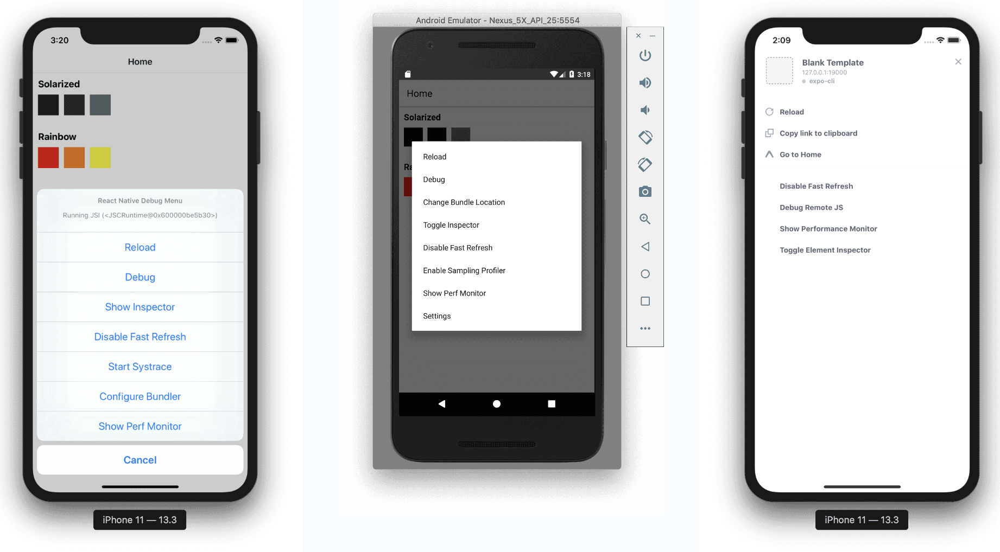

# Debugging

As developers, we spend a whole lot of time debugging, especially when learning something new. Let's look at some debugging tips for React Native.

## Debug menu

- on device - shake the device (yes, really!)
- iOS simulator - Cmd + D
- Android emulator - Cmd + M on Mac, Crl + M on Windows/Linux

The debug menus for iOS, Android and Expo look a bit different per platform, but they all have the same options available.

The main options you'll use are:

- refresh: this reloads the JavaScript bundle. You can also do this with Cmd + R (or Ctrl + R)
- debug: this opens a debug window in your browser
- show/hide inspector: this allows you to inspect individual elements on the page
- enable/disable fast refresh: you might know this as "hot reloading", it will update your app with your changes when you save the file, no need to refresh manually

## console.log() debugging

Sometimes it's just good to log stuff out to see what's going on. The good news is that `console.log()` works just the same on React Native as in plain JavaScript.

In order to log out to the console:

1. open the debug menu (as described above) and turn on debug - this will open a new browser window
2. inspect the browser window (right click + inspect for most browsers)
3. `console.log()` something in your app
4. the logged out text will appear in the browser console

Note:

1. `console.warn` will show a yellow box warning in React Native
2. `console.error` will show a full screen error

Note: there is a known bug in [VSCode](https://github.com/microsoft/TypeScript/issues/30471) where typing in console incorrectly auto imports `import console=require('console');`. You can get around this by turning off auto imports. Go to code => preferences => settings => auto imports to do this.

[Previous](./06.adding-linter.md)
[Next](./08.basic-rn-components.md)
