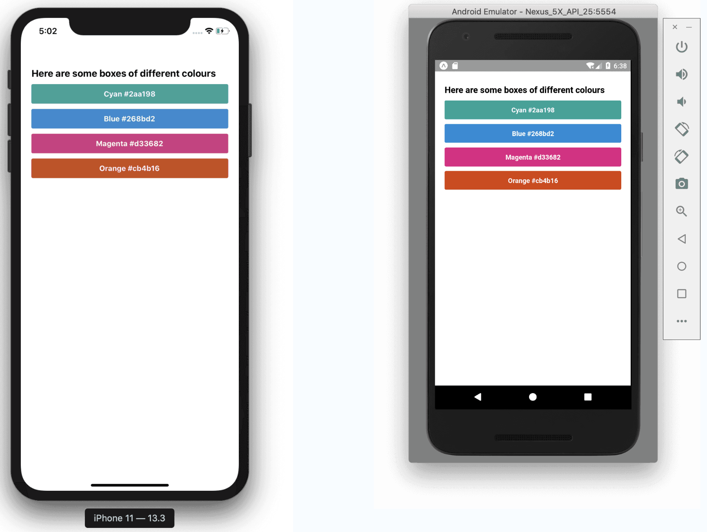

# Styling Exercise 📝

The best way to learn is by doing so let's start off by adding some colour. Here's a little app I built, showcasing come of my favourite colours. Try to recreate it!

Here are the colours I used:

```css
Cyan: #2aa198
Blue: #268bd2
Magenta: #d33682
Orange: #cb4b16
```



[Previous](./09.styling.md)
[Next](./11.styling-solution.md)
