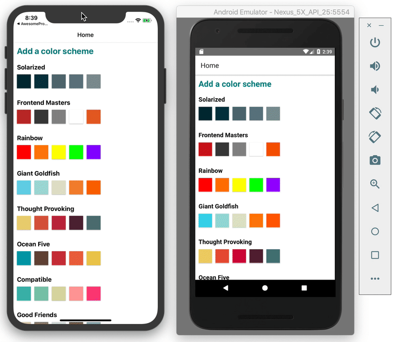
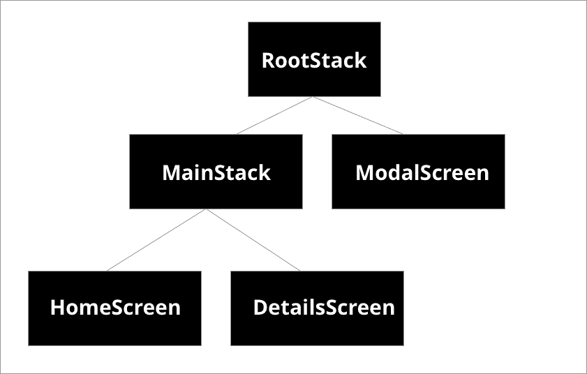

# Opening a full screen modal

Before we get stuck into our form challenge, we'll need to do some prep work. Specifically, we need to open a modal to put that form in. This requires some tinkering with navigation again, so we'll do that first. This is an animation of what we'd like to get to:



For the forms challenge, we'd like to be start adding our own color schemes to the list. But the best way to do that would be using a modal, so first we need to update out navigation so allow us to trigger display modals. In order to do this, we'll have to, once again, refactor our navigation.

Looking at our navigation as a tree, this is the layout we need to get to:



We'll be doing this following the react navigation [docs](https://reactnavigation.org/docs/modal/).

Our current layout only has the RootStack, HomeScreen, and DetailsScreen, so we need to add the a MainStack and a Modal Screen in the middle.

First lets rename our Stack to RootStack:

```jsx
// App.js

const RootStack = createStackNavigator();
```

Now below that, we declare our MainStack:

```jsx
// App.js

const MainStack = createStackNavigator();
```

Now let's add the MainStack and pull our existing navigation all out of the App component and into its own MainStackScreen component:

```jsx
// App.js

const MainStackScreen = () => {
  return (
    <MainStack.Navigator>
      <MainStack.Screen name="Home" component={Home} />
      <MainStack.Screen
        name="ColorPalette"
        component={ColorPalette}
        options={({ route }) => ({ title: route.params.paletteName })}
      />
    </MainStack.Navigator>
  );
};
```

Finally, update the App component to use RootStack and MainStackScreen:

```jsx
// App.js

const App = () => {
  return (
    <NavigationContainer>
      <RootStack.Navigator mode="modal">
        <RootStack.Screen
          name="Main"
          component={MainStackScreen}
          options={{ headerShown: false }}
        />
      </RootStack.Navigator>
    </NavigationContainer>
  );
};
```

Note that we had to use `mode="modal"` on `RootStack.Navigator` to tell the navigation that we're going to have a modal in there. We also had to add `options={{ headerShown: false }}` to `RootStack`.Screen. If we didn't do this, we'd end up with two top navs in our main stack!

Now all we need to do is add the modal. Create a new file called `ColorPaletteModal.js` in your `screens` directory and add some default content:

```jsx
// screens/AddNewPaletteModal.js

import React from 'react';
import { View, Text } from 'react-native';

const AddNewPaletteModal = () => {
  return (
    <View>
      <Text>Hello, world!</Text>
    </View>
  );
};

export default AddNewPaletteModal;
```

And finally import the Modal in your App.js and add the modal to the RootStack:

```jsx
import AddNewPaletteModal from './screens/AddNewPaletteModal';

// place this just before </RootStack.Navigator>
<RootStack.Screen name="AddNewPalette" component={AddNewPaletteModal} />;
```

[Previous](./26.forms-overview.md) | [Next](./28.form-exercise.md)
